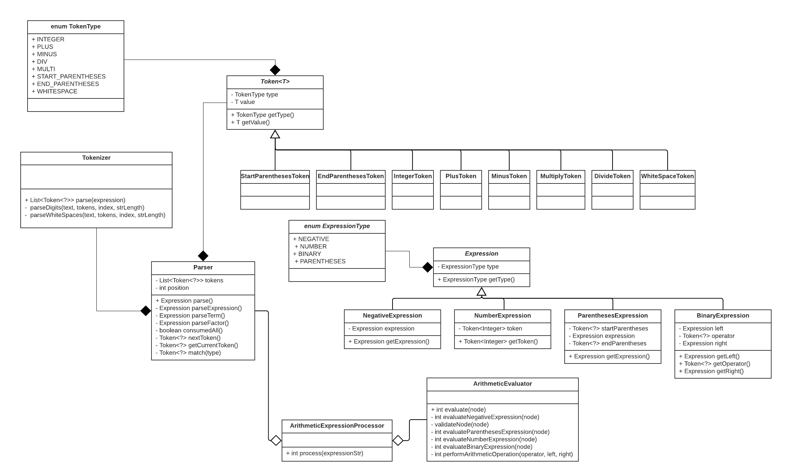

# Basic Arithmetic Compiler

This compiler goes through various stages: 
- [Tokenization](https://github.com/hrishikesh-mishra/compiler/blob/dev/src/main/java/com/hrishikeshmishra/compiler/tokens/Tokenizer.java, "Tokenization")
- [Parser (and creating Abstract Syntax Tree)](https://github.com/hrishikesh-mishra/compiler/blob/dev/src/main/java/com/hrishikeshmishra/compiler/parsers/Parser.java, "Parser") 
- [Evaluator](https://github.com/hrishikesh-mishra/compiler/blob/dev/src/main/java/com/hrishikeshmishra/compiler/evaluators/ArithmeticEvaluator.java "Evaluator")


## Tokenization
It creates the tokens from given string. This is limited to following tokens: 
- Digits (Limited to integer)
- Arithmetic Operators (+, -, * and /)
- Parentheses 
- Whitespaces 
- Negative Unary operator (-)

## Parser 
This uses **Recursive Descent Parsing**. This is one the top down parse without backtracking. The reason to choose the parse is easily to understand and implement.

The arithmetic CFG which used in implementation is:  
```
Expression -> [-] Term { PlusMinusOperation Term }
Term ->  Factor { MultiDiv Factor }
Factor ->  (Expression) | Number
PlusMinusOperation  ->  + | -
MultiDiv ->  * | /
Number → 0 | 1 | 2 | 3 | 4 | 5 | 6 | 7 | 8 | 9

Here,
 {} -> Represent the repetition of zero more times.
 [] -> Represent optional.   
```

Here, higher precedence operator goes to bottom / downward.
This parser produces the AST (abstract syntax tree).

This parser comes with some limitation: 
- Grammar, should not have Left Recursion, because program will stuck in infinite loop.
- Grammar should not be ambiguous.


## Evaluator
The evaluator traverse the AST produced by the Parser and evaluated the value. It evaluates following kinds of expression generated by parser: 
- Number Expression 
- Negative Expression 
- Parentheses Expression 
- And, Binary Expression. 


## Assumptions 
- Allowed binary operator: +, -, * and / and unary negative operator -.
- Limited to integer only but the result of some operation be overflow. 


## Low Level Design (LLD)


## How to run 
```shell script
#Compile with 
mvn clean install 

#Run script 
sh run.sh "<Your Arithmetic Expression >"

#Example 
sh run.sh "-(1) * 2 * (1+3)"

#Output

Debugging Expression Tree:  {"NegativeExpression": {"type" : "NEGATIVE", "expression" : {"BinaryExpression" : {"type" : "BINARY", "left" : {"BinaryExpression" : {"type" : "BINARY", "left" : {"ParenthesesExpression" : { "expression" : {"NumberExpression" : {"type" : "NUMBER", "token": "1"}}}}, "operator" :"*", "right" : {"NumberExpression" : {"type" : "NUMBER", "token": "2"}}}}, "operator" :"*", "right" : {"ParenthesesExpression" : { "expression" : {"BinaryExpression" : {"type" : "BINARY", "left" : {"NumberExpression" : {"type" : "NUMBER", "token": "1"}}, "operator" :"+", "right" : {"NumberExpression" : {"type" : "NUMBER", "token": "3"}}}}}}}}}} 
Give expression: -(1) * 2 * (1+3)  = -8 
```

## References
- https://en.wikipedia.org/wiki/Recursive_descent_parser
- http://web.cse.ohio-state.edu/software/2231/web-sw2/extras/slides/27.Recursive-Descent-Parsing.pdf 
- https://www.engr.mun.ca/~theo/Misc/exp_parsing.htm    
- https://www.youtube.com/watch?v=N9UuAPU6DAg
- https://www.youtube.com/watch?v=SH5F-rwWEog